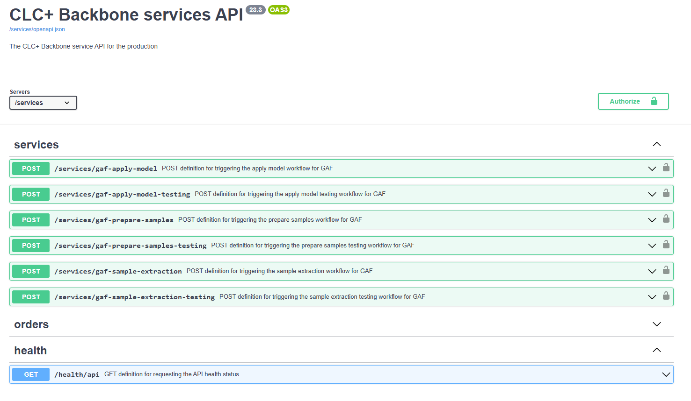
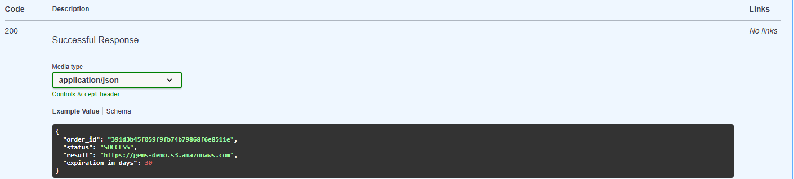
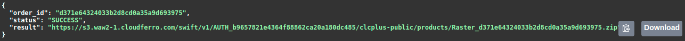

# Documentation Backbone System 2021

---

## Contributors

* Johannes Schmid
* Samuel Carraro
* Patrick Wolf
* Rafael Reder

## BACKBONE SYSTEM  - MANUAL API

* Issue: 2.0
* Date: 24/01/2025
* Compiled by: GEOVILLE & GAF AG

### Document Description

| Settings | Value |
|--|--|
|Document Title| Backbone System Manual: API |
|Project Title| Copernicus Land Monitoring Service – CLCplus Backbone Production, including Raster and Vector Products based on Satellite Input Data from 2017/2018/2019|
|Document Author(s)| GAF AG and GeoVille |
|Project Owner| Manuel Mayr (EEA) |
|Project Manager| Fabian Berndt (GAF)|
|Doc. Issue/Version| 2.0 |
|Date| 23/05/2022 |
|Distribution List| Consortium and EEA |
|Confidentiality| - |

### Document Release Sheet

| Name | Role | Date |
|--|--|--|
|Johannes Schmid (GeoVille)|Creation| 24/01/2025
|Fabian Berndt  (GAF)|Revision|-|
|Manuel Mayr (EEA) (GAF)|Approval|-|

### Document History & Change Record

  | Issue / Version | Release Date | Created by | Description of Issue / Change(s)|
  |--|--|--|--|
  |1.0|18.12.2021GeoVille / GAF AG |-|-|
  |1.1|-|GAF / GeoVille|Vector products|
  |2.0|-|GeoVille GmbH|-|

### Table of Contents

1. Executive Summary
2. EEAs Credentials
3. Ordering Steps 
  * Step 1: Get a bearer token 
  * Step 2: Order of the packaging into Raster or Vector 
  * Step 3: Checking the status of the Order 
4. Step 4: Downloading the Product
5. Example Visualization within QGIS of the Raster data and the Vector data

### 1. Executive Summary

This manual is intended to aim as step by step how-to for accessing and using the CLCplus Backbone “get_Product
API”. This API Endpoint will provide access to the products (i.e., Raster or Vector) stored within the WEkEO
CLCplus Backbone Data store (NetCDF with HDF5).

By using this document an implementation of the CLCplus Backbone Product API into the Copernicus Land
Monitoring System can be achieved.

### 2. EEAs Credentials

Please insert your credentials (user_id and client_secret) to create your bearer token to be able to order your
products by following the steps addressed below.

### 3. Ordering Steps

#### 3.1 Step 1: Get a bearer token

Swagger Endpoint for Testing

https://api.clcplusbackbone.geoville.com/v1/

**➔ auth (Authentication related operations)**

**POST**: /auth/get_bearer_token

* Click - “Try it out” button. When clicking this button, the black window box turns white (Figure 1) allowing the insertion of credentials. 

<em> Figure 1: Overview of the available endpoints.</em>

<em> Figure 7: Succesful response to order raster product.</em>

#### 3.3 Step 3: Checking the status of the Order

**➔ Services (Service related operations)**

**GET** /services/order_status/{order_id}

With the endpoint services/order_status/{order_id} the status of the order can be checked. The possible
states are:

* FAILED: An unexpected error occurred during the execution of the service
* SUCCESS: Service was successful - > RESULT String will deliver the download link
* QUEUED: Submitted request is in the waiting list
* RECEIVED: API received the service request and created an order ID
* RUNNING: Service is being calculated at the moment
* INVALID: It indicates that there is wrong input provided

Note: The cutting of the data takes some time to be donw, depending on the size of the provided geometry.
Average runtimes for ~10.000 km2 are within minutes (Raster being the faster delivered products,
compared to Vector ones).

* Click the “Try it out” button. 
* Insert the access token from Step 2 into the Authorization box. (i.e. Bearer zZYqplU66dFTb9BZRg1ekyWhrWwBxpbJqdnZfPNU1S)
* Provide the order_id from step 2.
* After doing so, click on the “Execute” button. In case the Order is successful the Response will carry the result paths to the S3 object-store at WEkEO.

<em> Figure 10: Example of Successful order.</em>

### Step 4: Downloading the Product

To download the product to the customer from the S3 storage. For this procedure, @WEkEO standard S3
mechanisms can be implemented. Note that the Filename is of your response.

### 5. Example Visualization within QGIS of the Raster data and the Vector data

* tfw - Images are stored as raster data wherein each cell in the image has a row and column number. Vector data, such as feature classes in geodatabases, shapefiles, and coverages, is stored in real-world coordinates. To display images with this vector data, it is necessary to establish an image-to-world transformation that converts the image coordinates to real-world coordinates. This transformation information is typically stored with the image.
* .tif – dataset itself
* .xml - standard XML Files and widely adopted by many systems to store and read metadata that might or might not be in the header of the file
* aux.xml - the histogram information for the image - which is often only a .aux file rather than having .xml on the end of that.
* .tif.vat.cpg - a code page file, which gives the character encoding for whatever it refers to. In this case that dbf file. Note that .vat is a value attribute table aka raster attribute table
* .tif.ovr - the pyramid file, basically some lower resolution duplicates of the image to speed up redraw when zoomed out
* .tif.clr - The Colormap function is a type of raster data renderer. It transforms the pixel values to display the raster data as either a grayscale or a color (RGB) image based on specific colors in a color map file, or based on a color ramp. You can use a color map to represent analyzed data, such as a classified image, or when displaying a topographic map (or index color-scanned image). When the Colormap function is used, ArcGIS will display the mosaic dataset using the color map renderer or with a specified
color ramp.
* .qml - A file with .qml extension is a XML file that stores layer styling information for QGIS layers. QGIS is an open-source cross-platform GIS application used to display geospatial data with the capability of organizing data in the form of layers. QML files contain information that is used by the QGIS to render feature geometries including  symbol definitions, sizes and rotations, labelling, opacity, blend mode, and much more. Unlike the QLR files, QML files contains all the styling information in itself.
* txt – same information as the .clr and .qml but also explaining the classes by names